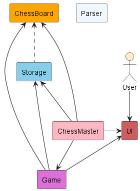
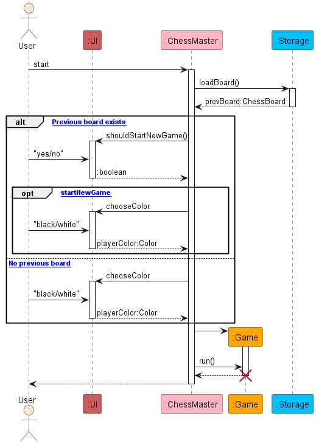
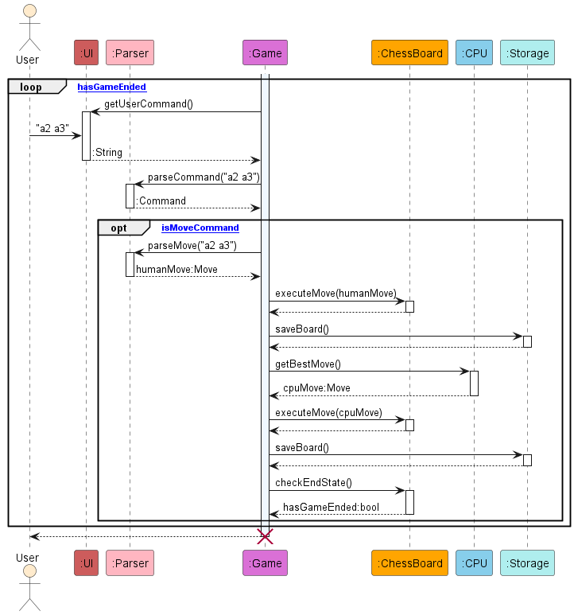
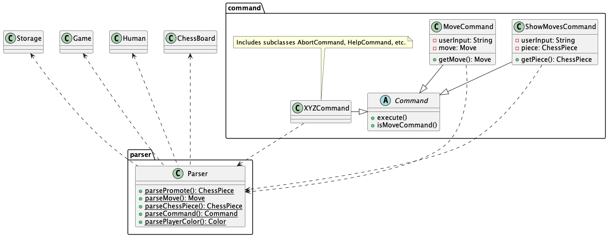
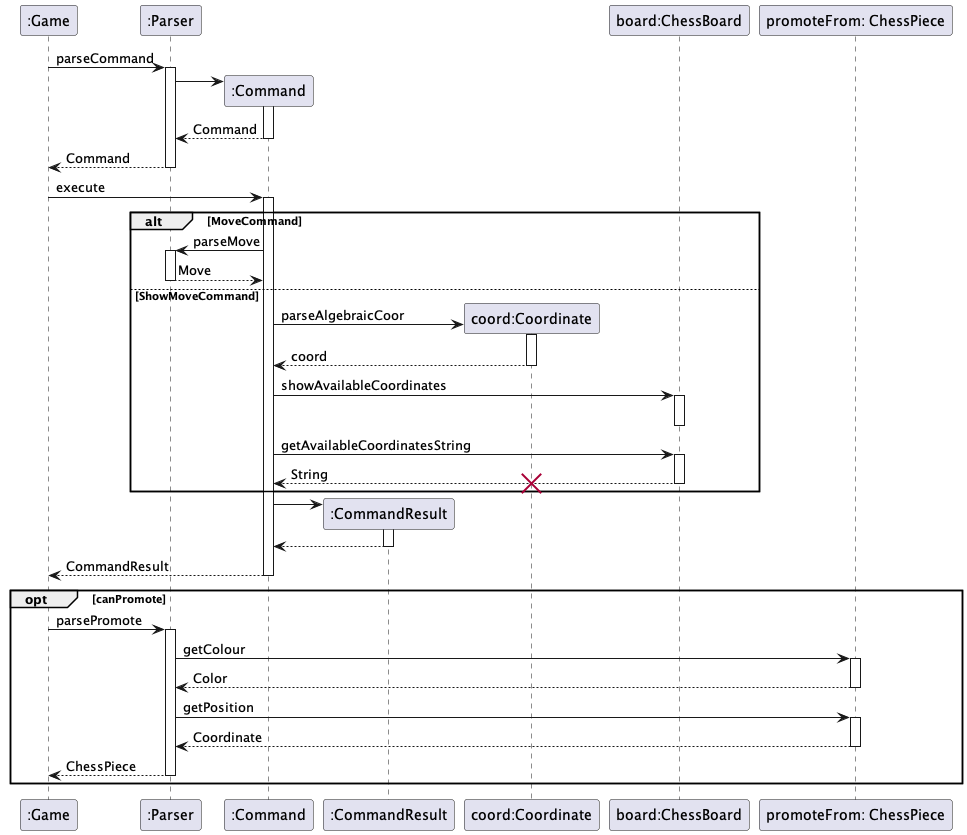
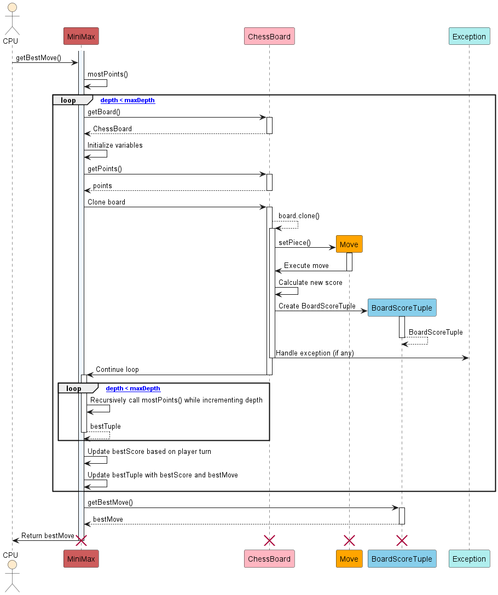
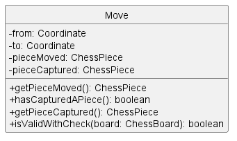
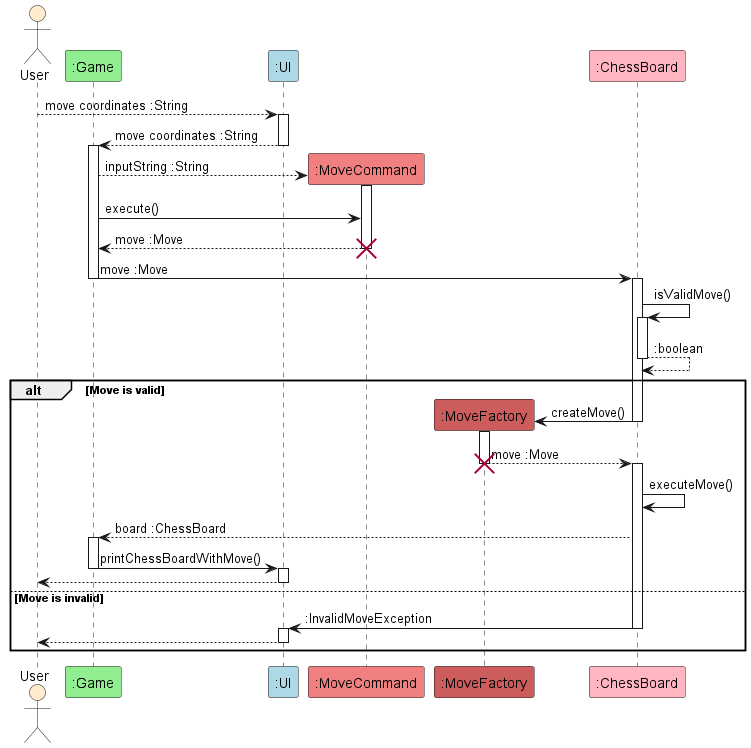
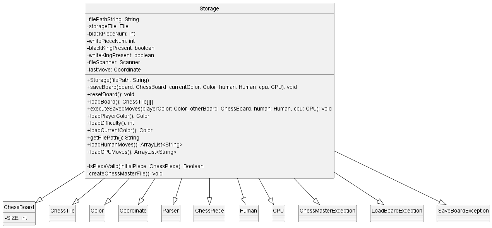

# Developer Guide

- [Design and implementation](#design-and-implementation)
    - [Architecture](#architecture)
        - [Main components of the architecture](#main-components-of-the-architecture)     
    - [ChessMaster component](#chessmaster-component)
    - [Game component](#game-component)
    - [User input handling](#user-input-handling)
    - [Minimax algorithm](#minimax-algorithm)
    - [Move types](#move-types)
    - [Storage component](#storage-component)
- [Product scope](#product-scope)
    - [Target user profile](#target-user-profile)
    - [Value proposition](#value-proposition)
- [User stories](#user-stories)
- [Non-functional requirements](#non-functional-requirements)
- [Manual testing](#manual-testing)
    - [End-to-end testing](#end-to-end-testing)

## Design and implementation



### Architecture

The Architecture Diagram given above explains the high-level design of the application. Given below is a quick overview of main components and how they interact with each other.

#### Main components of the architecture

`ChessMaster` is the main invocation of the application. It handles the loading of previous chess games from the storage file and running of the chess `Game` instance.  

The remaining logic is handled by the following components:
- **UI**: The User Interface of the application
- **Game**: Executes user commands in game and CPU moves
- **Storage**: Reads and write chess game information to the hard disk
- **ChessBoard**: Holds the current chess board state in memory
- **Parser**: Parses string representations into relevant classes (`Command`, `Move`, `ChessPiece`, etc)

Our application also uses other classes to store information about the chess game and provide utility functions for the main components to function. This include: `Command`, `Move`, `Coordinate`, `Color`,  `Player`, `ChessTile` and `ChessPiece(s).`

### ChessMaster component

The sequence diagram below illustrates the interactions within the ChessMaster component, when they launch the program.
The user has the option to terminate the game anytime during this interaction with `exit`, however, this event is not depicted in the diagram for simplicity.



How does ChessMaster component work:

1. Attempts to load previously stored game in storage
2. If previous game exists, asks the user if a new game or the previous game should be loaded. 
3. If a new game is selected, the user will be prompted for the color and difficulty to start. 
4. Start running the new or previous game instance.

### Game component

The sequence diagram below illustrates the interactions within the Game component.



How does the Game component work:
1. Solicits input from user. Users can provide game commands, if not recognised, it will parse as a `MoveCommand`.
2. The returned command will be executed.
3. If user entered a game command (not MoveCommand), the next user input will be solicited.
4. If a MoveCommand is identified, the user's input will be parsed as a Move object with checks to ensure it is a valid move on the chessboard.
5. The user's validated Move will be executed on the chess board. This move will then be saved in the storage file.
6. Next, it will be the CPU's turn to play. The best move will be calculated by the CPU object and it will be executed on the chess board. This move will also be saved in the storage file.
7. Once both the user and CPU has made their moves, the game state will be checked where the number of kings on the board and the winner will be determined.

### User input handling
Below is a class diagram representing the Command and Parser classes.



In order to handle user input into the program during the game, the `Parser` class was implemented.
Below is a sequence diagram describing the process of handling user input passed from `Game`:



`Parser` works to resolve a player's input in the following manner:

1. When `Parser` is called to parse a command, it returns the relevant `Command` object (More precisely,
one of its subclasses e.g. `MoveCommand`), which is then executed by `Game`.
2. Depending on the type of `Command` returned, the following may occur: 
   1.  If it is a `MoveCommand`, the Command calls `parseMove` to instantiate the `Move`,
   which is passed back to `Game` to be executed in the main logic.
   2. If it is a `ShowMovesCommand`, `parseAlgebraicCoor` is called to obtain the position of the piece as a 
   `Coordinate` object. The available coordinates are printed using `showAvailableCoordinates`, then stored as a String
   by `getAvailableCoordinatesString()`.
3. The result is then encapsulated in a `CommandResult` and returned to `Game` to be handled.
4. If the player made a move resulting in a promotion, `parsePromote` is called.
5. `Parser` calls `getColor` and `getPosition` to retrieve relevant data from the `ChessPiece` 
the player wants to promote.
6. The user's input is parsed and a new `ChessPiece` is returned.

`Parser` also contains methods to fulfil parsing needs in other parts of the program, for instance `parseChessPiece`, 
which is called while loading the .txt file containing save data, called for each character representing a 
singular chess piece. Using a Case statement, it returns the relevant `ChessPiece` object depending on the character
(representing the type of piece), and whether it is capitalised (representing colour).

How the parsing works:
- When called upon to parse a user command, the `Parser` class returns a relevant subclass of the `Command` class
  (i.e. entering a valid command "XYZ" will cause `Parser` to return an `XYZCommand` object)
- Each `Command` subclass contains the relevant methods to execute the specified command
(AbortCommand, ShowCommand, etc.) and inherit from the abstract `Command` class.

### Minimax algorithm

The minimax algorithm is used to determine the best move for the AI to make. It is a recursive algorithm that works by alternatingly minimising opponent scores and maximising CPU scores. The algorithm is implemented in the `Minimax` class.



How the minimax algorithm works:
1. The `Minimax` class is called by the `Game` class to determine the best move for the CPU to make.
2. The `Minimax` class calls the `getPossibleMoves` method in the `ChessBoard` class to get all possible moves for the CPU.
3. The `Minimax` class then calls the `getBestMove` method to determine the best move for the CPU to make by maximising CPU score and minimizing the player score.
4. The `getBestMove` method calls the `getBestMove` method recursively to populate the child scores.
5. The `getBestMove` method returns the best move for the CPU to make.

### Move types
The Move class and its subclasses are responsible for handling the different types of moves in chess. 
The Move class is an abstract class that is extended by the following subclasses: StandardMove, PawnOpening, CastleMove, EnPassantMove and PromotionMove. 
The Move class is also extended by the following classes: CastleSide, Direction, MoveDirection, MoveType and PromotionPiece.
Below is a class diagram representing the Move class.



#### Standard moves
Standard moves are the most common type of moves in chess. They are moves that involve moving a piece from one tile to another without considering special cases. Standard moves are further classified into two types: normal moves and capture moves. This information is implemented in the ChessPiece classes.

How standard moves are generated:
1. The chess piece has directions that it can move in. For example, a rook can move in the up, down, left and right directions. 
2. The chess piece has a maximum number of steps it can take in each direction. For example, a rook can move any number of steps in the up, down, left and right directions as constrained by the chess board.
3. The chess piece cannot move past another chess piece. For example, a rook cannot move past another chess piece in the up, down, left and right directions.
4. Any chess piece that "blocks" the path of the chess piece is checked for colour. If the chess piece is of the same colour, the chess piece cannot move past it. If the chess piece is of the opposite colour, the chess piece can capture it. For example, a rook can capture an enemy chess piece in the up, down, left and right directions. (Note that pawn moves are an exception to this rule. Pawn pieces can only capture enemy chess pieces in the forward diagonal directions.)
5. Special cases such as castling, en passant and promotion are also encoded as `directions` and executed separately with different move functions.

Below is a sequence diagram representing the process of generating and executing moves.



#### Pawn Opening
A pawn opening is a special type of move that involves moving a pawn from its starting position to another tile two spaces ahead. This move is only valid if the pawn is in its starting position and the tile it is moving to as well as the tile in between is empty. 

#### Castling
Castling is a special type of move that involves moving the king and rook at the same time. This move is only valid if the king and rook have not moved before and there are no pieces between them. Castling is further classified into two types: king-side castling and queen-side castling. This information is implemented in the ChessPiece King and Rook classes and executed with the CastleMove and CastleSide classes.

#### En Passant
En passant is a special type of move that involves capturing a pawn that has just moved two spaces. This move is only valid if the pawn is in the correct position and the pawn is the last piece to move. This information is implemented in the Pawn class and executed with the EnPassantMove class. 

#### Promotion
Promotion is a special type of move that involves promoting a pawn to another piece. This move is only valid if the pawn is in the correct position, which is at the other end of the board from which it starts. This information is implemented in the Pawn class and executed with the PromotionMove class.


### Storage Component
Below is a class diagram representing the Storage class.
The Storage component is responsible for handling the storage and retrieval of chess game state.



Below is a sequence diagram of the storage class.
It includes only the more essential methods (createChessmasterFile, saveBoard, loadBoard, resetBoard) required for the main storing and loading of information, to prevent the diagram from being too complex.


Here is a brief overview of how the storage handles the data storage:
1. For the storing of information, it creates the necessary parent directories for the file and the file itself if they don't exist
2. In the text file, the following contents are stored in order, each taking up a line:
   1. Player's color information 
   2. Game difficulty
   3. Color of the next player (the color to be played upon the loading of game)
   4. Human player's past moves in the form of comma-separated string
   5. CPU's past moves in the form of comma-separated string 
   6. State of the chessboard in an 8x8 format, taking up 8 lines.
3. For the loading of information the above saved information are loaded (Player's color, game difficulty, next turn's color, player's moves, CPU's moves and board state)
4. To ensure data is not corrupted, the executeSavedMoves method parses the saved player's moves and CPU's moves to check against the saved board state 
5. Other features include resetting the game by clearing the contents of the file.


## Product scope
### Target user profile
1. Novice players trying to practice chess and play chess offline without a chess set. 
2. Time-poor users looking for a very simple, clean, gimmick-free chess application.

### Value proposition
- Chess novices can use ChessMaster CLI to learn the game's rules and practice their skills.
- Busy students can open the application up in their terminal easily for a quick game of chess.
- The CLI interface is intuitive, making it easy for beginners to understand moves and strategies

## User stories

| Version | As a ...   | I want to ...                                          | So that I can ...                                      |
|---------|------------|--------------------------------------------------------|--------------------------------------------------------|
| v1.0    | new user   | see usage instructions                                 | refer to them when I forget how to use the application |
| v1.0    | player     | do only valid moves                                    | play chess properly                                    |
| v1.0    | player     | start a new game                                       | play chess multiple times                              |
| v1.0    | player     | see the current state of the chess board on every turn | think about what move to play                          |
| v1.0    | player     | tell which symbol represents which piece               | know what is where                                     |
| v1.0    | player     | specify move coordinates                               | move the piece I want how I want it                    |
| v1.0    | player     | promote pieces when the option is available            | play extended games properly                           |
| v1.0    | player     | have the option to abort the game                      | leave the game when I no longer want to play           |
| v1.0    | player     | save and get back to a game                            | leave when I am busy and resume a game when I am free  |
| v2.0    | new player | see available moves for a piece                        | learn the rules of chess and valid moves               |
| v2.0    | new player | refresh the rules of chess anytime                     | recap and learn the rules of chess                     |
| v2.0    | player     | see past move history                                  | recap through the gameplay                             |
| v2.0    | player     | see captured pieces                                    | gauge the state of the game                            |


## Non-functional requirements

1. Should work on any mainstream OS as long as it has Java 11 or above installed. 
2. A user with a basic understanding of chess should be able to navigate the game without difficulty. 
{More to be added}

## Manual testing

This section describes the process of manual testing for ChessMaster. ChessMaster utilises `JUnit 5.10.0` for automated testing. Please ensure you are using the same version before proceeding.

### End-to-end testing

In addition to unit tests, we have also set up functionality for end-to-end tests. End-to-end testing, in the context of ChessMaster, involves testing the entire program, simulating user interactions, and verifying that the system functions as expected. These tests cover a wide range of scenarios, from setting up the game to making moves and evaluating outcomes.

The general idea is to compare expected output to real output, as usual. But we must first capture the `System.out` output to be able to call `assertEquals()` on it with the expected output. This is what our class `ConsoleCapture` does: it just redirects all output from `System.out` to a new, temporary stream. We start the stream before each test, run the game, and then `stopCapture()` after the game is complete.

In general, to create your own end-to-end test, follow these steps:

1. Create a test class: Start by creating a new Java class in the `./src/test/java/chessmaster/endtoend` directory. The name of your class should reflect the feature or scenario you plan to test e.g. `HistoryTest` tests the History command.
2. Capture program output: To capture the program's output, you can use the `ConsoleCapture` class. This class redirects all output from `System.out` to a temporary stream, allowing you to capture the output during the test. Begin capturing the output before each test and stop it after the test is complete.
3. Define test input: Construct your test input as a string, ensuring it ends with the abort command or a win condition, depending on your test's requirements.
4. Run the game: Create and run the game, allowing the test to take in the input you defined in the previous step.
5. Capture and compare output: Utilise `ConsoleCapture` to capture the program's output and compare it to the expected output. The expected output should be saved in a text file under the `./src/test/resources` directory.
6. Cleanup: After the test is complete, be sure to stop capturing the output and perform any necessary cleanup steps.

Some sample stub code is provided below.

```java
public class Test {
    @BeforeEach
    public void setup() {
        // Create temporary storage file just for tests
        String filepath = "testingStorage.txt";
        File file = new File(filepath);
        try {
            file.createNewFile();
        } catch (IOException e) {
            System.out.println("An error occurred: " + e.getMessage());
        }
        this.storage = new Storage(filepath);

        consoleCapture = new ConsoleCapture();
        consoleCapture.startCapture();
    }

    @AfterEach
    public void shutdown() {
        String filepath = "testingStorage.txt";
        File file = new File(filepath);
        file.delete();
    }

    @Test
    public void historyCommand_twoMovesWhiteStarts() {
        // Convert user input string to an InputStream and tell Java to use it as the input
        String testInput = "<your input here>";
        ByteArrayInputStream in = new ByteArrayInputStream(testInput.getBytes());
        System.setIn(in);

        // Need to create TextUI() after setting System input stream
        ui = new TextUI();

        // Create a new board and game with your desired testing preferences
        board = new ChessBoard();
        Game game = new Game();

        // Run the game. This will automatically use the `testInput` string as user input
        game.run();

        // Compare captured output with expected output and assert
        consoleCapture.stopCapture();
        String capturedOutput = consoleCapture.getCapturedOutput();
        String expectedOutput = readExpectedOutputFromFile("src/test/resources/historyCommand_twoMovesWhiteStarts.txt");

        assertEquals(expectedOutput, capturedOutput);
    }
}
```

Some notes about the above code:
- @BeforeEach test we create a new storage Object and startCapturing() System.out data.
- Inside each @Test we first tell Java to use our given string as user input instead of stdin.
- Then we create our board and game with whichever starting color and orientation we want.
- We run the game, and then compare the real output to the expected output.
- Here, the expected output is saved in a .txt file under ./src/test/resources
- @AfterEach test we delete the storage file.

Things to note when creating your own test:
- `testInput` MUST end with the abort command (or a win condition) for the test to run properly.
- Save your expected output in a file named with the same test method name for documentation purposes.

By following these steps, you can create end-to-end tests that cover various gameplay scenarios and command usage. These tests help ensure that the program functions correctly and produces the expected output in response to user interactions.


