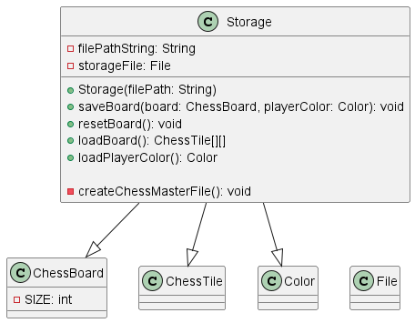

# Developer Guide

## Acknowledgements

{list here sources of all reused/adapted ideas, code, documentation, and third-party libraries -- include links to the original source as well}

## Design & implementation

### Architecture

The Architecture Diagram given above explains the high-level design of the application. Given below is a quick overview of main components and how they interact with each other.

#### Main components of the architecture

`ChessMaster` is the main invocation of the application. It handles the loading of previous chess games from the storage file and running of the chess `Game` instance.  

The remaining logic is handled by the following components:
- **UI**: The User Interface of the application
- **Game**: Executes user commands in game and CPU moves
- **Storage**: Reads and write chess game information to the hard disk
- **ChessBoard**: Holds the current chess board state in memory
- **Parser**: Parses string representations into relevant classes (`Command`, `Move`, `ChessPiece`, etc)

Our application also uses other classes to store information about the chess game and provide utility functions for the main components to function. This include: `Command`, `Move`, `Coordinate`, `Color`,  `Player`, `ChessTile` and `ChessPiece(s).`

### ChessMaster component

<!-- Here is a partial class diagram of ChessMaster.  -->

The sequence diagram below illustrates the interactions within the ChessMaster component, when they launch the program. 

How does ChessMaster component work:

1. Attempts to load previously stored game in storage
2. If previous game exists, asks the user if a new game or the previous game should be loaded. 
3. If a new game is selected, the user will be prompted for the color to start. 
4. Start running the new or previous game instance. 

### Game component

The sequence diagram below illustrates the interactions within the Game component, taking a move of "a2 a3" as example.

How does the Game component work:
1. Solicits input from user. Users can provide game commands, if not recognised, it will parsed as a `MoveCommand`.
2. The returned command will be executed.
3. If user entered a game command (not MoveCommand), the next user input will be solicited.
4. If a MoveCommand is identified, the user's input will be parsed as a Move object with checks to ensure it is a valid move on the chessboard.
5. The user's validated Move will be executed on the chess board. This move will then be saved in the storage file.
6. Next, it will be the CPU's turn to play. The best move will be calculated by the CPU object and it will be executed on the chess board. This move will also be saved in the storage file.
7. Once both the user and CPU has made their moves, the game state will be checked where the number of kings on the board and the winner will be determined.

### Architecture

### User Input Handling - `Parser` and `Command`
Below is a class diagram representing the Command and Parser classes.

In order to handle user input into the program during the game, the `Parser` class was implemented.
Below is a sequence diagram describing the process of handling user input passed from `Game`:

`Parser` works to resolve a player's input in the following manner:

1. When `Parser` is called to parse a command, it returns the relevant `Command` object (More precisely,
one of its subclasses e.g. `MoveCommand`), which is then executed by `Game`.
2. Depending on the type of `Command` returned, the following may occur: 
   1.  If it is a `MoveCommand`, the Command calls `parseMove` to instantiate the `Move`,
   which is passed back to `Game` to be executed in the main logic.
   2. If it is a `ShowMovesCommand`, `parseAlgebraicCoor` is called to obtain the position of the piece as a 
   `Coordinate` object. The available coordinates are printed using `showAvailableCoordinates`, then stored as a String
   by `getAvailableCoordinatesString()`.
3. The result is then encapsulated in a `CommandResult` and returned to `Game` to be handled.
4. If the player made a move resulting in a promotion, `parsePromote` is called.
5. `Parser` calls `getColor` and `getPosition` to retrieve relevant data from the `ChessPiece` 
the player wants to promote.
6. The user's input is parsed and a new `ChessPiece` is returned.

`Parser` also contains methods to fulfil parsing needs in other parts of the program, for instance `parseChessPiece`, 
which is called while loading the .txt file containing save data, called for each character representing a 
singular chess piece. Using a Case statement, it returns the relevant `ChessPiece` object depending on the character
(representing the type of piece), and whether it is capitalised (representing colour).

How the parsing works:
- When called upon to parse a user command, the `Parser` class returns a relevant subclass of the `Command` class
  (i.e. entering a valid command "XYZ" will cause `Parser` to return an `XYZCommand` object)
- Each `Command` subclass contains the relevant methods to execute the specified command
(AbortCommand, ShowCommand, etc.) and inherit from the abstract `Command` class.

### Minimax algorithm

The minimax algorithm is used to determine the best move for the AI to make. It is a recursive algorithm that works by alternatingly minimising opponent scores and maximising CPU scores. The algorithm is implemented in the `Minimax` class.

How the minimax algorithm works:
1. The `Minimax` class is called by the `Game` class to determine the best move for the CPU to make.
2. The `Minimax` class calls the `getPossibleMoves` method in the `ChessBoard` class to get all possible moves for the CPU.
3. The `Minimax` class then calls the `getBestMove` method to determine the best move for the CPU to make by maximising CPU score and minimizing the player score.
4. The `getBestMove` method calls the `getBestMove` method recursively to populate the child scores.
5. The `getBestMove` method returns the best move for the CPU to make.

### Storage Component
**API:**

Below is a class diagram representing the Storage class.
The Storage component is responsible for handling the storage and retrieval of chess game state.

* Creates the necessary parent directories for the file and the file itself if they don't exist 
* Saves the current state of the ChessBoard to the file. It includes the player's color information and current player's turn as the first line and the state of the chessboard in an 8x8 format.
* Allows resetting the game by clearing the contents of the file.
* Loads the state of the chessboard from the file by constructing a 2D array of ChessTile objects.

## Product scope
### Target user profile

{Describe the target user profile}

### Value proposition

{Describe the value proposition: what problem does it solve?}

## User Stories

|Version| As a ... | I want to ... | So that I can ...|
|--------|----------|---------------|------------------|
|v1.0|new user|see usage instructions|refer to them when I forget how to use the application|
|v1.0|player|only move valid moves|play chess properly|
|v1.0|new user|start a new game|play chess multiple times|
|v1.0|player|see the current state of the chess board on every turn|think about what move to play|
|v1.0|player|tell which symbol represents which piece|know what is where|
|v1.0|player|specify move coordinates|move the piece I want how I want it|
|v1.0|player|promote pieces when the option is available|play extended games properly|
|v1.0|player|have the option to abort the game|leave the game when I no longer want to play|
|v2.0|user|find a to-do item by name|locate a to-do without having to go through the entire list|
{more to be added}

## Non-Functional Requirements

1. Should work on any mainstream OS as long as it has Java 11 or above installed. 
2. A user with a basic understanding of chess should be able to navigate the game without difficulty. 
{More to be added}

## Glossary

* *glossary item* - Definition

## Instructions for manual testing

{Give instructions on how to do a manual product testing e.g., how to load sample data to be used for testing}
